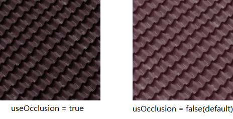
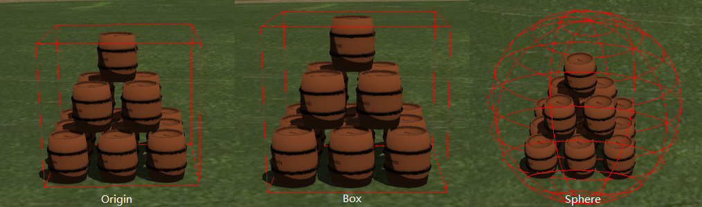

# objTo3d-tiles
Node command line tool convert obj model file to 3D Tiles, based on [obj2gltf](https://github.com/AnalyticalGraphicsInc/obj2gltf).

[Online Demonstration](https://princessgod.github.io/plc/batchedTileset.html)

>NOTE: Only support `.b3dm` for now!
>
>Please use Cesium after v1.37, cause this 3d tile use glTF2.0.

## Getting Start
Clone this repository to local.

```
git clone https://github.com/PrincessGod/objTo3d-tiles.git
```

Navigate in the repository folder.

```
cd objTo3d-tiles
```

Make sure you have [Node](https://nodejs.org/en/) installed, and then

```
npm install
```

### Basic Usage

* Convert `.obj` to `.gltf`

```
node ./bin/obj23dtiles.js -i ./bin/barrel/barrel.obj
// Export barrel.gltf at same folder.
```

* Convert `.obj` to `.glb`

```
node ./bin/obj23dtiles.js -i ./bin/barrel/barrel.obj -b  
// Export barrel.glb at same folder.
```

>NOTE: More detial to convert `.gltf` and `.glb` can find at [obj2gltf](https://github.com/AnalyticalGraphicsInc/obj2gltf).

>NOTE: If your model using blinn-phong material, and use occlusion when convert to PBR material, the model will looks darker.
>So `useOcclusion` default is false, so remember adding `--useOcclusion` if your model using PBR material. Here are some showcase about it.

<p align="center"></p>


* Convert `.obj` to `.b3dm` with default batch table, which have `batchId` and `name` property, and `name` is model's name.

```
node ./bin/obj23dtiles.js -i ./bin/barrel/barrel.obj --b3dm
// Export barrel.b3dm at same folder.
```

* Convert `.obj` to `.b3dm` with default batch table and export default batch table (a JSON file). Maybe get information for custom batch table.

```
node ./bin/obj23dtiles.js -i ./bin/barrel/barrel.obj --b3dm --outputBatchTable
// Export barrel.b3dm and barrel_batchTable.json at same folder.
```

* Convert `.obj` to `.b3dm` with custom batch table.

```
node ./bin/obj23dtiles.js -i ./bin/barrel/barrel.obj -c ./bin/barrel/customBatchTbale.json --b3dm
// Export barrel.b3dm with custom batch table at same folder.
```

### Create Tileset

* Create a single tileset with `.b3dm` tile.

```
node ./bin/obj23dtiles.js -i ./bin/barrel/barrel.obj --tileset
// Export ./Batchedbarrel folder at same folder which is a tileset.
```

* Create a single tileset with `.b3dm` tile and custom tileset options.

```
node ./bin/obj23dtiles.js -i ./bin/barrel/barrel.obj --tileset -p ./bin/barrel/customTilesetOptions.json
// Export ./Batchedbarrel folder at same folder which is a tileset with custom tileset options.
```

The `customTilesetOptions.json` can have options bellow, and these are fake values, if do not have custom tileset config, these value will be auto calculate through `.obj` file.

```
{
    "longitude":      -1.31968,     // Tile center's(models' point (0,0,0)) longitude in radian.
    "latitude":       0.698874,     // Tile center's latitude in radian.
    "transHeight":    0.0,          // Model height in meters.
    "minHeight":      0.0,          // BoundingVolume minimum height in meters.
    "maxHeight":      40.0,         // BoundingVolume maximum height in meters.
    "tileWidth":      200.0,        // Tile horizontal(cross longitude) length in meters.
    "tileHeight":     200.0,        // Tile virtical(cross latitude) length in meters.
    "geometricError": 200.0,        // Tile geometric error in meters.
    "region":         true,         // Using region bounding volume.
    "box":            false,        // Using box bounding volume.
    "sphere":         false         // Using sphere bounding volume.
    //"transfrom" : Matrix4         // Using for custom transform.
}

```
>NOTE: If you are not specify the `transHeight` option, your model will be place at earth ground surface, which means no matter what the height your models are,
>the lowerest point of your models will be place at `height = 0.0` on the earth. But if you want keep origin heigth you just need specify `transHeight = 0.0`.

Here are different bounding volumes.
<p align="center"></p>

## Troubleshooting
First, make sure your `.obj` file is complete, normally include `.obj`, `.mtl` and textures like `.jpg` or `.png`.
You can preview your `.obj` model via "Mixed Reality Viewer" if your in windows 10.
Otherwise you can use this [online viewer](https://3dviewer.net/).
<br />
<br />
Second, export `.glb` and check if it display correctly. You can use
[Cesium](https://www.virtualgis.io/gltfviewer/) or [Three.js](https://gltf-viewer.donmccurdy.com/) gltf viewer.
<br />
<br />
In the end, just export `.b3dm` or tileset and load in Cesium.

## Sample Data
Sample data under the `.bin\barrel\` folder. 

```
barrel\
    |
    - barrel.blend              --
    |                             |- Blender project file with texture.
    - barrel.png                --
    |
    - barrel.obj                --
    |                             |- Obj model files.
    - barrel.mtl                --
    |
    - customBatchTable.json     ---- Custom batchtable used in demonstration.
    |
    - customTilesetOptions.json ---- Custom tileset optional parameters.
    |
    - output\                   ---- Export data by using upper files.
        |
        - barrel.glb
        |
        - barrel.gltf
        |
        - barrel_batchTable.json    ---- Default batch table.
        |
        - Batchedbarrel\            ---- Tileset output
        |   |
        |   - tileset.json
        |   |
        |   - barrel.b3dm
        |
        - BatchedTilesets\          ---- Tileset with custom tileset.json
            |
            - tileset.json
            |
            - barrel_withDefaultBatchTable.b3dm
            |
            - barrel_withCustonBatchTable.b3dm
```

## Resources
* Online glTF viewer, make sure your glTF is correct. [Cesium](https://www.virtualgis.io/gltfviewer/), [Three.js](https://gltf-viewer.donmccurdy.com/).
* [Cesium](https://github.com/AnalyticalGraphicsInc/cesium)
* [3D Tiles](https://github.com/AnalyticalGraphicsInc/3d-tiles)
* [glTF](https://github.com/KhronosGroup/glTF)

## Credits
Great thanks to Sean Lilley([@lilleyse](https://github.com/lilleyse)) for helping and advising.

Thanks [AnalyticalGraphicsInc](https://github.com/AnalyticalGraphicsInc) provide a lot of open source project (like [Cesium](https://github.com/AnalyticalGraphicsInc/cesium) and [3D Tiles](https://github.com/AnalyticalGraphicsInc/3d-tiles)) and creat a great GIS environment.

## License
[Apache License 2.0](https://github.com/PrincessGod/objTo3d-tiles/blob/master/LICENSE)
